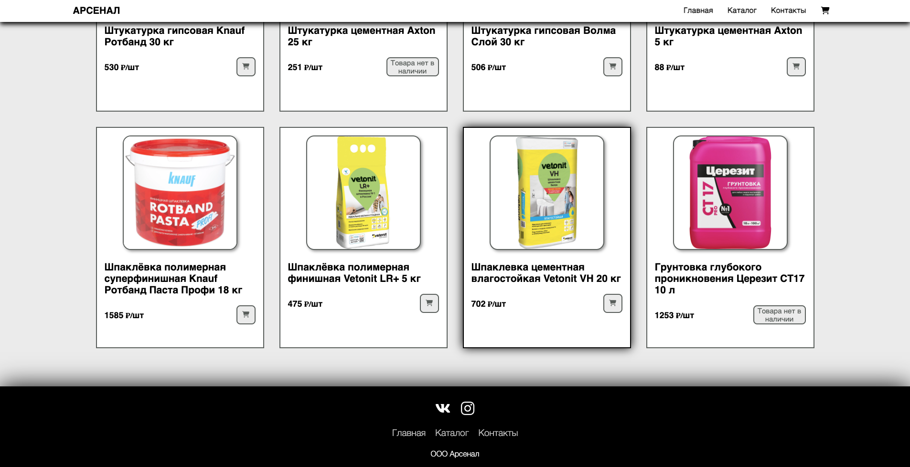

# **Интернет-магазин**
В данном проекте я занимаюсь созданием интернет-магазина, используя **`HTML`**, **`CSS`**, **`JavaScript`**, **`PHP`**.

## **Текущий результат**
Сайт можно посмотреть [здесь](http://arsenal-building.ru).

## **Как реализован сайт?**

Об этом напишу совсем скоро)

## **TODO**

+ реализовать скрипт для `footer` и `header`, чтобы избавить от копипасты в каждом файле `.html`
+ добавить нормальное оформление карточки продукта
+ добавить оформление валидации всех форм
+ реализовать защиту от заказа продукта в большем количестве, чем он есть в наличии
+ ограничение на размер фотографии в отзыве